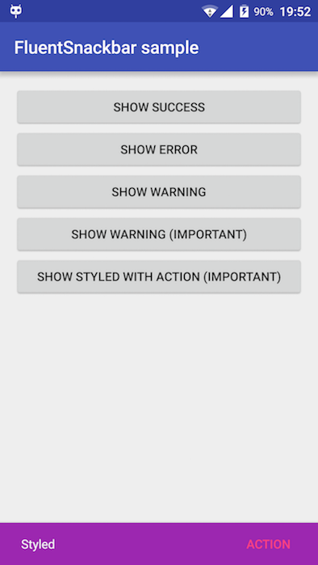

# FluentSnackbar
[](https://jitpack.io/#antonygolovin/fluentsnackbar)
[](https://android-arsenal.com/details/1/3757)

Tiny library that uses Android Design Support Library and lets you create and show snackbars in a fluent manner. Contains queue feature. You can also download sample [apk](https://github.com/AntonyGolovin/FluentSnackbar/tree/master/fluentsnackbar-sample/sample.apk).

  

### All you need to know

```java
public class MainActivity extends AppCompatActivity {

    private FluentSnackbar mFluentSnackbar;

    @Override
    protected void onCreate(Bundle savedInstanceState) {
        super.onCreate(savedInstanceState);
        setContentView(R.layout.activity_main);

        mFluentSnackbar = new FluentSnackbar(this);

        mFluentSnackbar.create("Text")
                .maxLines(2) // default is 1 line
                .backgroundColorRes(R.color.purple_500) // default is #323232
                .textColorRes(R.color.blue_grey_500) // default is Color.WHITE
                .duration(Snackbar.LENGTH_SHORT) // default is Snackbar.LENGTH_LONG
                .actionText("Action text") // default is "Action"
                .actionTextColorRes(R.color.colorAccent)
                .important()
                .action(new View.OnClickListener() {
                    @Override
                    public void onClick(View v) {
                        Toast.makeText(MainActivity.this, "Action clicked", Toast.LENGTH_SHORT).show();
                    }
                })
                .show();
    }
}

```

If you want to show several messages following one by one you can use `important()` method. Such snackbars cannot be dismissed by another snackbars and will be shown throughout their duration. So you can create a queue of snackbars. Just call `important()` and then `show()` for each `FluentSnackbar.Builder`. 

### Gradle dependency 

Add this in your root `build.gradle`:
```gradle
allprojects {
    repositories {
        ...
        maven { url "https://jitpack.io" }
    }
}
```

and then add this in your module `build.gradle`:

```gradle
dependencies {
    compile 'com.github.antonygolovin:fluentsnackbar:0.1.3'
}
```
